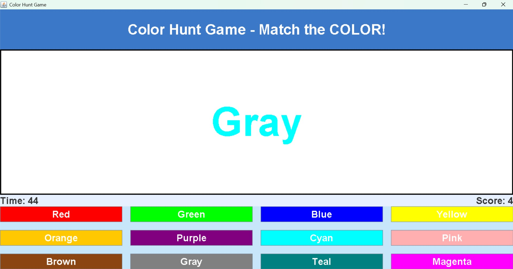

# 🎮 ColorHuntGame

ColorHuntGame is a simple Java Swing–based game that tests the player’s focus and color recognition skills.

## 🧠 Game Objective
The player must **match the actual color of the displayed text**, not the color name written.

## ✨ Features
- Java Swing GUI
- 60-second timer
- Score system (+1 correct, −2 wrong)
- Animated buttons
- Full-screen gameplay
- Randomized color challenges

## 🕹 How to Play
1. A word is displayed in a random color.
2. Ignore the word text.
3. Click the button whose **color matches the text color**.
4. Score as high as possible before time runs out.

## 📸 Screenshot
Below is a screenshot of the game while running:


## 🛠 Technologies Used
- Java
- Swing
- AWT

## ▶ How to Run
```bash
javac ColorHuntGame.java
java ColorHuntGame
```

## 👩‍💻 Author
- Siri Chandana 